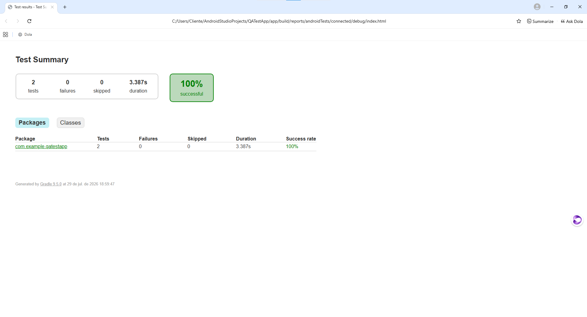
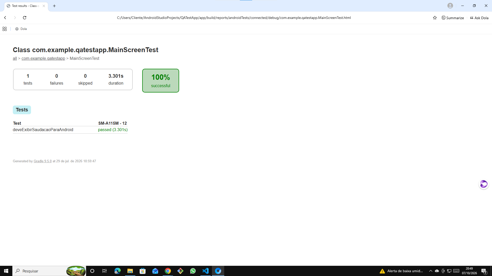

# 📱 Automação de Testes Android — Espresso & Jetpack Compose


Primeiro projeto de testes instrumentados Android, desenvolvido como desafio da **Digital Innovation One (DIO)**. O objetivo foi configurar o ambiente, escrever um teste de UI com Jetpack Compose e executá-lo em um **dispositivo físico**.

## 📌 Sobre o Projeto

App Android simples construído com Jetpack Compose, com um teste de interface que valida a exibição da mensagem de saudação na tela principal.

## 🧪 Testes Implementados

| Classe | Teste | O que valida |
|---|---|---|
| `MainScreenTest` | `deveExibirSaudacaoParaAndroid` | A saudação é exibida corretamente na tela principal |
| `ExampleInstrumentedTest` | `useAppContext` | Teste padrão do Android Studio: confirma o contexto do app |

## 🛠️ Tecnologias

| Tecnologia | Uso |
|---|---|
| Kotlin | Linguagem do app e dos testes |
| Jetpack Compose | Interface declarativa do Android |
| Espresso / Compose Testing | Testes instrumentados de UI |
| Gradle | Build e execução dos testes |

## 📱 Ambiente de Execução

- **Dispositivo:** Samsung Galaxy A11 (SM-A115M), Android 12
- **Relatório:** gerado automaticamente pelo Gradle

## ▶️ Como Executar

```bash
git clone https://github.com/IdnaReis/qa-testapp-espresso-compose.git
# Abra no Android Studio, conecte um dispositivo e rode:
./gradlew connectedAndroidTest
```

## 📸 Evidências

**Resumo da execução: 2 testes, 0 falhas, 100% de sucesso**



**Teste da tela principal (MainScreenTest)**



## 🚀 Próximos Passos

- Adicionar testes de navegação e interação com componentes
- Organizar os testes com Robot Pattern

## 👩‍💻 Autora

**Idna Reis**
QA | Analista de Qualidade | Automação de Testes

[](https://www.linkedin.com/in/idna-reis)
[](https://github.com/IdnaReis)
